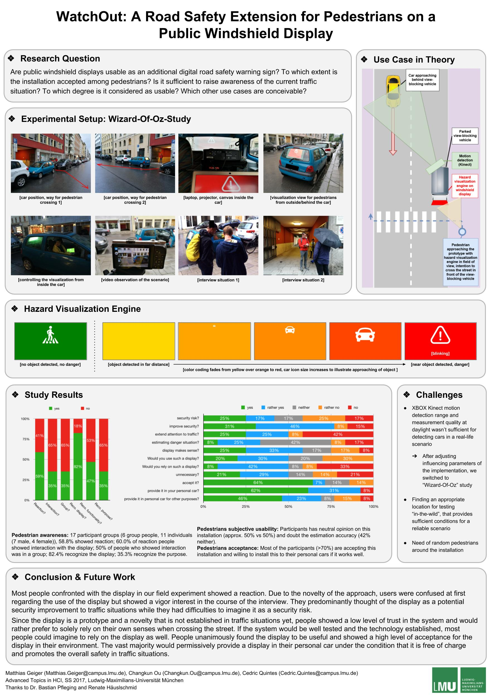

# ATH SS17: Windshild Display Project

We conducted a field study to investigate whether public windshield displays are applicable as an additional interactive digital road safety warning sign. We focused on investigating the acceptance and usability of our novel public windshield display and its potential use for future applications. The study has shown that users are open-minded to the idea of an extraverted windshield display regardless the use case, whether it is used for safety purposes or different content. Contrary to our hypothesis most people assumed they would mistrust the system if it were as well established as traffic lights and primarily rely on their own perception.

## Resources

- [Paper](./paper/ath.pdf)
- [Poster](./poster/poster_ath.jpg)
- [Source Code](./src)
- [User Study Data](./data)

## Poster Preview

## License

Matthias Geiger, Changkun Ou, Cedric Quintes &copy; MIT & CC-BY-ND-NC 4.0